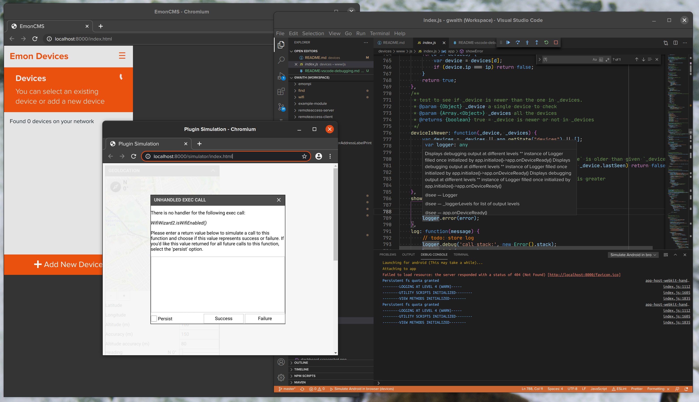

# Debugging
> This page is part of the [EmonCMS Devices README][parent-page]


Debugging [EmonCMS devices][repo] can be done with Android Device or Simulated Android in a Browser.


## Cordova Tools vscode Extentions
Just search for and install the `Cordova Tools` extention from within vscode to enable the required features.
> Visual Studio Marketplace [msjsdiag.cordova-tools][extention docs] extention

Once the extention is installed you can press `F5` to start debugging

## Debugging Cordova apps with vscode
> How to [live-preview your code][microsoft docs] in a browser
<cite>- microsoft.com</cite>

If you use vscode to `live-preview` your code in a browser there are a few api calls that require responses to be supplied.

[](vscode-debug-screenshot.png?raw=true)
<br><em>Screenshot of simulator (left), simulator asking for response (center) and vscode in debug screen (left)</em>

The following are the examples I've been using to test with: (paste them into the "Android in a browser simulator" reponses for each call)


---------------------


# Example API Responses

### WifiWizard2.isWifiEnabled()
This just requires a success or fail response to test. I tested with both to see the result on the application.
> eg: "true"`    -> click [SUCCESS]`

### WifiWizard2.getConnectedSSID()
You can respond with any `String`, however if you use your actual wifi connection name the "current connection" will be correctly hightlighted in the access point list
> eg: "BTHub5-AAAA"`    -> click [SUCCESS]`

### WifiWizard2.getWifiIp()
You can respond with any `String`, however try entering in a similar IP address to your local network
> eg: "192.168.1.222"`    -> click [SUCCESS]`

### WifiWizard2.scan()
This will simulate a wifi scan to see all available accesspoints (one device and one standard ap)
```JSON
[
  {
    "level": -32,
    "SSID": "smartplug5339",
    "BSSID": "86:f3:eb:00:00:00",
    "frequency": 2412,
    "capabilities": "[ESS]",
    "timestamp": 1893205094332,
    "channelWidth": 0,
    "centerFreq0": 0,
    "centerFreq1": 0
  },
  {
    "level": -62,
    "SSID": "BTHub5-AAAA",
    "BSSID": "08:36:c9:00:00:00",
    "frequency": 2427,
    "capabilities": "[WPA2-PSK-CCMP][ESS][WPS]",
    "timestamp": 1893205094360,
    "channelWidth": 0,
    "centerFreq0": 0,
    "centerFreq1": 0
  }
]
```
`    -> click [SUCCESS]`

### WifiWizard2.add([SSID]])
`    -> click [SUCCESS]`

### WifiWizard2.connect([SSID]])
`    -> click [SUCCESS]`
> WifiWizard2.connect() is the same as calling formatWifiConfig() then add() then enable()

### CordovaHttpPlugin.post([host], [username], [password])
This returns error not data if there is an error
```JSON
{
    "status":200,
    "url":"http://test.localhost",
    "data":"{\"success\": true,\"userid\": 0,\"apikey_write\": \"e31da26bd2f9807930cad74adb9853a0\",\"apikey_read\": \"6c255f8156fe09694a9a316fb36db971\"}",
    "headers":{}
}
```
`    -> click [SUCCESS]`

or an error
```JSON
{
    "status":404,
    "url":"http://test.localhost",
    "error":"{\"success\": false, \"message\": \"Incorrect authentication\"}",
    "headers":{}
}
```
`    -> click [FAILURE]`

### ZeroConf.reInit()
This just requires a success or fail response to test. Value is not important.
`    -> click [SUCCESS]`

### ZeroConf.watch()
This requires a specific JSON object with known properties:
> eg: `{"action":"resolved","service":{"domain":"local.","type":"_workstation._tcp.","name":"emonpi [b8:27:b8:27:b8:27]","port":9,"hostname":"","ipv4Addresses":["192.168.1.186"],"ipv6Addresses":["fe80::b03c:1111:1111:1111"],"txtRecord":{}}}`
`    -> click [SUCCESS]`

5 more different example responses:-
```JSON
{"action":"added","service":{"domain":"local.","type":"_http._tcp.","name":"smartplug5339","port":0,"hostname":"smartplug5339._http._tcp.local.","ipv4Addresses":[],"ipv6Addresses":[],"txtRecord":{"smartplug5339._http._tcp.local.":"true"}}}
{"action":"resolved","service":{"domain":"local.","type":"_http._tcp.","name":"smartplug5339","port":80,"hostname":"","ipv4Addresses":["192.168.1.78"],"ipv6Addresses":[],"txtRecord":{}}}
{"action":"added","service":{"domain":"local.","type":"_http._tcp.","name":"openevse-8970","port":0,"hostname":"openevse-8970._http._tcp.local.","ipv4Addresses":[],"ipv6Addresses":[],"txtRecord":{"openevse-8970._http._tcp.local.":"true"}}}
{"action":"resolved","service":{"domain":"local.","type":"_http._tcp.","name":"openevse-8970","port":80,"hostname":"","ipv4Addresses":["192.168.1.81"],"ipv6Addresses":[],"txtRecord":{}}}
{"action":"added","service":{"domain":"local.","type":"_workstation._tcp.","name":"emonpi [b8:27:b8:27:b8:27]","port":0,"hostname":"emonpi [b8:27:b8:27:b8:27]._workstation._tcp.local.","ipv4Addresses":[],"ipv6Addresses":[],"txtRecord":{"emonpi [b8:27:b8:27:b8:27]._workstation._tcp.local.":"true"}}}
```
> you could also use the `avahi-discover` terminal command to see your actual results and change the above examples to match

### ZeroConf.close()
This just requires a success or fail response to test. Value is not important.
`    -> click [SUCCESS]`


--------------------

> Please edit this file if you have additional examples that might be useful to others.

[extention docs]: <https://marketplace.visualstudio.com/items?itemName=msjsdiag.cordova-tools>
[microsoft docs]: <https://docs.microsoft.com/en-us/visualstudio/cross-platform/tools-for-cordova/run-your-app/simulate-in-browser?view=toolsforcordova-2017>
[parent-page]: https://github.com/emoncms/cordova-emon-devices/README.md
[repo]: https://github.com/emoncms/cordova-emon-devices