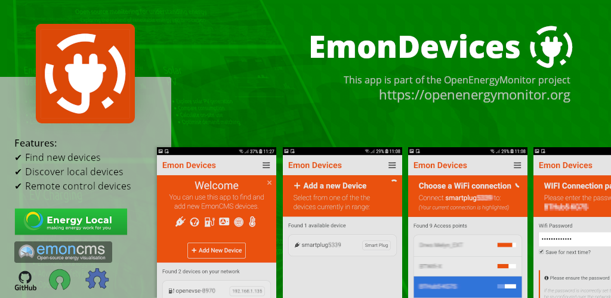

## EmonCMS Devices App
> [Debug][child-debug-docs] | [Deploy][child-deploy-docs] | [Documentation][child-jsdoc-docs] | [vscode][child-vscode-docs]



This is a "Companion App" for [EmonCMS][emoncms] to discover compatible devices on your network. 

New devices can also be "paired" using this app.

> Currently Android 10+ users cannot "Add new devices" via the app - [issue created](https://github.com/emoncms/cordova-emon-devices/issues/1)

New devices automatically create Wi-Fi hotspots when not connected to a local network. 
Once you connect to these hotspots you can configure the device to connect to your local Wi-Fi connection.

This app will discover these hotspots and connect your device to your Wi-Fi without manual configuration.

You can also sign into your dashboard to allow your device to be controlled online as well as locally.

Written with [Apache Cordova][cordova-docs] - works on multiple devices, however main development done one Android 9. 
Other devices and versions should be compatible with this Cordova App.

> :information_source: please post [github issue][issues] to track problems and fixes

---

## Screenshots

Screenshots of the web based [Energy Local Dashboard][dashboard] and this App running on Android

> :link: You can control your device using your [Energy Local Dashboard][dashboard] account

<table>
    <tr>
        <td>
            <a href="dashboard-screenshot.png?raw=true" alt="Dashbaord Screenshot">
                
            </a>
            <br>
            <em>Dashboard showing device synced with the <a href="https://octopus.energy/agile/">Octopus Agile tariff</a> pricing</em>
        </td>
        <td>
            <a href="app-screenshot.png?raw=true" alt="App Screenshot">
                
            </a>
            <br>
            <em>App showing discovered devices</em>
        </td>
    </tr>
</table>

---

# Run on Android device

```bash
$ git clone https://github.com/emoncms/cordova-emon-devices.git && cd devices
$ cordova platform add android
$ npm install
$ cordova run android --device
```

> Above commands assumes [npm][npm-docs] and [cordova][cordova-docs] are installed on the local machine and 
> that the android device is in [developer mode][android-docs] with USB debugging enabled.

## Required Cordova plugins

```bash
$ cordova plugin add cordova-plugin-zeroconf
$ cordova plugin add https://github.com/tripflex/wifiwizard2
$ cordova plugin add cordova-plugin-advanced-http
$ cordova plugin add cordova-plugin-inappbrowser
$ cordova plugin add cordova-plugin-device
$ cordova plugin add cordova-plugin-network-information
```

or as one liner...

```bash
$ cordova plugin add cordova-plugin-zeroconf https://github.com/tripflex/wifiwizard2 cordova-plugin-advanced-http cordova-plugin-inappbrowser cordova-plugin-device cordova-plugin-network-information
```

> __⚠ issue with android 10 security policies not allowing apps to create/drop wifi connections. [issue created](https://github.com/emoncms/cordova-emon-devices/issues/1)

---

## Issues compling

You may have problems compiling, try to remove then add the cordova platform to fix this:

```bash
$ cordova platform remove android
$ cordova platform add android
```

or remove the whole `platform` directory and re-add:

```bash
$ rm -rf platforms && cordova platform add android
```

> __⚠ NOTE__ : The Cordova plugins will also need to be re-installed once you remove a platform

# Issues

If you find any issues please add them to the [issue tracker][issues]

---

# Code Documentation

Using jsdoc to produce documentation
moved the instructions to [README-docs.md][child-jsdoc-docs]

---

# Deploy App

You must increase the `android-versionCode` every time you want to push a new release to the Play Store.

moved the instructions to [README-deploy.md][child-deploy-docs]

---

# Debugging

Using vscode code debugging tools

moved the instructions to [README-testing.md][child-debug-docs]

---

# Todo

Please use the [repo issues tracker][issues] to suggest new features

- Translation - i18n label placeholders and translations
- Upgrade the WiFiWizard2 plugin once android 10 is supported.

---

[dashboard]: <https://dashboard.energylocal.org.uk>
[emoncms]: <https://github.com/emoncms/emoncms>
[android-docs]: <https://developer.android.com/studio/debug/dev-options>
[npm-docs]: <https://www.npmjs.com/get-npm>
[cordova-docs]: <https://cordova.apache.org>

[issues]: <https://github.com/emoncms/cordova-emon-devices/issues>
[child-debug-docs]: <https://github.com/emoncms/cordova-emon-devices/blob/main/README-debug.md>
[child-deploy-docs]: <https://github.com/emoncms/cordova-emon-devices/blob/main/README-deploy.md>
[child-jsdoc-docs]: <https://github.com/emoncms/cordova-emon-devices/blob/main/README-jsdoc.md>
[child-vscode-docs]: <https://github.com/emoncms/cordova-emon-devices/blob/main/README-vscode-debugging.md>
